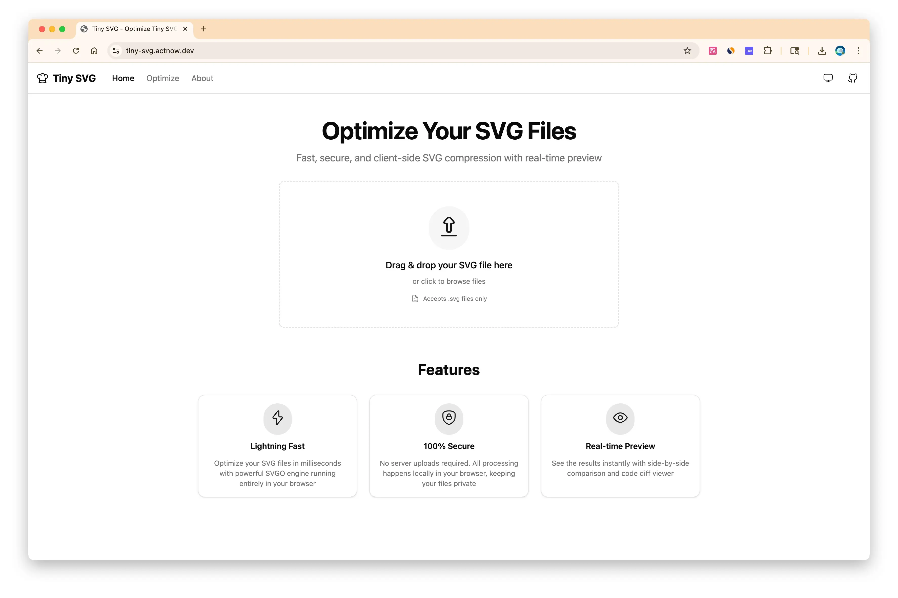
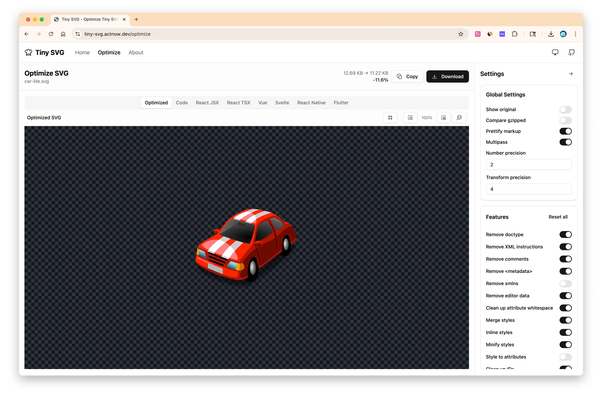

# Tiny SVG

<div align="center">


**A modern, lightning-fast SVG optimizer and code generator**

[](https://tiny-svg.actnow.dev)
[](./LICENSE)
[](https://www.typescriptlang.org/)
[](https://tanstack.com/start)

[Live Demo](https://tiny-svg.actnow.dev) · [Features](#features) · [Quick Start](#quick-start) · [Documentation](#documentation)

</div>

---

## 📖 Overview

**Tiny SVG** is a powerful web application for optimizing SVG files and generating framework-specific code. Built with modern web technologies, it provides a seamless experience for developers and designers working with SVG assets.

### ✨ Key Features

- **🚀 SVG Optimization**: Powered by SVGO with 40+ configurable plugins
- **📦 Code Generation**: Generate React (JSX/TSX), Vue, Svelte, React Native, and Flutter code
- **⚡ Web Workers**: Non-blocking optimization using multi-threaded processing
- **🎨 Visual Preview**: Real-time preview with multiple background styles
- **💾 Persistent Settings**: Your preferences saved across sessions
- **📱 Responsive Design**: Works seamlessly on desktop and mobile
- **🌓 Dark Mode**: Full dark mode support
- **🌍 Internationalization**: Multi-language support (EN, ZH, KO, DE)
- **⚡ Lightning Fast**: Optimized bundle with lazy loading and code splitting

---

## 📸 Screenshots

### Home Page


Simple, intuitive interface to get started quickly.

### Optimize Page


Powerful optimization tools with real-time preview and code generation.

---

## 🚀 Quick Start

### Prerequisites

- **Node.js**: >= 18.x
- **pnpm**: >= 9.x (recommended package manager)

### Installation

```bash
# Clone the repository
git clone https://github.com/your-username/tiny-svg.git
cd tiny-svg

# Install dependencies
pnpm install
```

### Development

This is a **pnpm workspace** monorepo. Start the development server:

```bash
# Start all workspace apps (runs in all apps/*)
pnpm dev

# Or start only the web app
pnpm dev:web
```

Open [http://localhost:3001](http://localhost:3001) in your browser.

### Build

Build for production:

```bash
# Build all workspace packages
pnpm build

# Or build only the web app
pnpm --filter web build

# Preview the production build locally
pnpm --filter web serve
```

Build output will be in `apps/web/.output/`:
- `client/` - Static client assets
- `server/` - Server-side code for SSR

### Code Quality

Run linting and formatting:

```bash
# Check and fix issues (runs on entire workspace)
pnpm check

# Type check all packages
pnpm check-types
```

---

## 🏗️ Tech Stack

### Core Framework
- **[TanStack Start](https://tanstack.com/start)** - Modern SSR framework with file-based routing
- **[React 19](https://react.dev/)** - UI library with latest features
- **[TypeScript 5](https://www.typescriptlang.org/)** - Type-safe development

### Styling & UI
- **[Tailwind CSS 4](https://tailwindcss.com/)** - Utility-first CSS framework
- **[Radix UI](https://www.radix-ui.com/)** - Accessible component primitives
- **[shadcn/ui](https://ui.shadcn.com/)** - Re-usable component collection
- **[Iconify](https://iconify.design/)** - Unified icon framework

### Internationalization
- **[Intlayer](https://intlayer.org/)** - Type-safe i18n library for React
- **Languages Supported**: English, Chinese (简体中文), Korean (한국어), German (Deutsch)

### State Management & Data
- **[Zustand](https://zustand-demo.pmnd.rs/)** - Lightweight state management
- **[Zod](https://zod.dev/)** - TypeScript-first schema validation

### Optimization & Processing
- **[SVGO](https://github.com/svg/svgo)** - SVG optimization engine
- **[Prettier](https://prettier.io/)** - Code formatter for generated code
- **[Web Workers](https://developer.mozilla.org/en-US/docs/Web/API/Web_Workers_API)** - Multi-threaded processing

### Code Quality
- **[Biome](https://biomejs.dev/)** - Fast linter and formatter
- **[Ultracite](https://ultracite.dev/)** - Strict TypeScript configuration

### Build & Deploy
- **[Vite 7](https://vite.dev/)** - Next-generation build tool
- **[Cloudflare Workers](https://workers.cloudflare.com/)** - Serverless deployment platform
- **[Wrangler](https://developers.cloudflare.com/workers/wrangler/)** - CLI for Cloudflare Workers

---

## 📚 Features in Detail

### SVG Optimization

- **40+ SVGO Plugins**: Fine-grained control over optimization
- **Global Settings**: Configure precision, multipass, and prettify options
- **Real-time Preview**: See changes instantly with zoom controls
- **Compression Statistics**: View file size reduction and compression rate
- **Batch Processing**: Optimize multiple SVGs efficiently

### Code Generation

Generate optimized code for your favorite framework:

- **React JSX** - JavaScript components
- **React TSX** - TypeScript components with full type safety
- **Vue** - Single File Components (.vue)
- **Svelte** - Svelte components
- **React Native** - react-native-svg components
- **Flutter** - flutter_svg widgets

### Preview & Visualization

- **4 Background Styles**:
  - Transparent Light (checkerboard)
  - Transparent Dark (dark checkerboard)
  - Solid Light (white)
  - Solid Dark (dark gray)
- **Zoom Controls**: 10% - 200% zoom range
- **Side-by-Side Comparison**: Compare original vs optimized
- **Code Diff View**: Monaco-powered diff editor

### Performance Optimizations

- **Web Workers**: SVGO, Prettier, and code generation run in separate threads
- **Lazy Loading**: Components load on-demand
- **Code Splitting**: Optimized bundle chunking (monaco, prettier, svgo, ui)
- **Result Caching**: Smart LRU cache with 5-minute TTL
- **Optimized Bundle**: Main optimize route only 15.79 KB (97.4% reduction)

---

## 🗂️ Project Structure

```
tiny-svg/
├── apps/
│   └── web/                      # Main web application
│       ├── src/
│       │   ├── components/       # React components
│       │   │   ├── lazy/        # Lazy-loaded wrappers
│       │   │   ├── optimize/    # Optimize page components
│       │   │   └── ui/          # Reusable UI components
│       │   ├── contents/        # i18n content definitions
│       │   │   ├── home.content.ts
│       │   │   ├── about.content.ts
│       │   │   └── optimize.content.ts
│       │   ├── hooks/           # Custom React hooks
│       │   │   ├── use-auto-compress.ts
│       │   │   ├── use-code-generation.ts
│       │   │   ├── use-local-storage.ts
│       │   │   └── ...
│       │   ├── lib/             # Utility functions
│       │   │   ├── svgo-config.ts      # SVGO configuration
│       │   │   ├── svg-to-code.ts      # Code generators
│       │   │   └── worker-utils/       # Worker utilities
│       │   ├── routes/          # File-based routing
│       │   │   └── {-$locale}/  # Locale-based routing
│       │   │       ├── index.tsx    # Home page
│       │   │       ├── about.tsx    # About page
│       │   │       └── optimize.tsx # Optimize page
│       │   ├── store/           # Global state (Zustand)
│       │   └── workers/         # Web Workers
│       │       ├── svgo.worker.ts
│       │       ├── code-generator.worker.ts
│       │       └── prettier.worker.ts
│       ├── public/              # Static assets
│       ├── intlayer.config.ts   # i18n configuration
│       └── vite.config.ts       # Vite configuration
├── docs/
│   └── images/                  # Documentation images
├── package.json                 # Root package.json
└── README.md                    # This file
```

---

## 🔧 Configuration

### SVGO Plugins

Configure SVGO optimization through the UI or modify `lib/svgo-plugins.ts`:

```typescript
export const DEFAULT_PLUGINS: SvgoPluginConfig[] = [
  { name: 'removeDoctype', enabled: true },
  { name: 'removeXMLProcInst', enabled: true },
  { name: 'removeComments', enabled: true },
  // ... 40+ plugins
];
```

### Vite Configuration

Customize build settings in `apps/web/vite.config.ts`:

```typescript
export default defineConfig({
  build: {
    rollupOptions: {
      output: {
        manualChunks: {
          monaco: ['@monaco-editor/react', 'monaco-editor'],
          prettier: ['prettier/standalone', /* ... */],
          svgo: ['svgo'],
          ui: ['@radix-ui/*'],
        },
      },
    },
  },
});
```

---

## 📝 Usage Examples

### Optimizing an SVG

1. **Upload** or **paste** your SVG code
2. **Configure** SVGO plugins in the sidebar
3. **Preview** the optimized result
4. **Download** or **copy** the optimized SVG

### Generating Framework Code

1. Optimize your SVG first
2. Switch to **code generation tabs** (React JSX/TSX, Vue, etc.)
3. **Prettify** the code if needed
4. **Copy** or **download** the generated code

### Customizing Preview

1. Click the **background button** to cycle through styles
2. Use **zoom controls** to adjust preview size
3. Compare **original vs optimized** in side-by-side view

---

## 🚀 Deployment

### Cloudflare Workers (Recommended)

This project is optimized for Cloudflare Workers deployment with full SSR support.

#### Prerequisites

1. **Cloudflare Account**: Sign up at [cloudflare.com](https://cloudflare.com)
2. **Wrangler CLI**: Already included in dependencies

#### Setup

1. **Login to Cloudflare**:
```bash
pnpm wrangler login
```

2. **Configure `wrangler.toml`** (already configured):
```toml
name = "tiny-svg"
compatibility_date = "2024-01-01"
main = ".output/server/index.mjs"
assets = { directory = ".output/client" }

[observability]
enabled = true

# Optional: Custom domain
# routes = [
#   { pattern = "tiny-svg.actnow.dev", custom_domain = true }
# ]
```

3. **Deploy**:
```bash
# Deploy the web app (builds and deploys automatically)
pnpm --filter web deploy
```

Your app will be deployed to: `https://tiny-svg.workers.dev`

#### Custom Domain

To use a custom domain:

1. Add your domain to Cloudflare
2. Update `wrangler.toml`:
```toml
routes = [
  { pattern = "your-domain.com", custom_domain = true }
]
```
3. Deploy: `pnpm deploy`

#### Environment Variables

Set environment variables using Wrangler:

```bash
# Set a variable
pnpm wrangler secret put VARIABLE_NAME

# List all variables
pnpm wrangler secret list
```

Or use `.dev.vars` for local development:

```bash
# apps/web/.dev.vars
VARIABLE_NAME=value
```

#### Deployment Best Practices

- **Build locally first**: Run `pnpm --filter web build` to catch errors before deploying
- **Test with preview**: Use `pnpm --filter web serve` to test the production build locally
- **Check bundle size**: Monitor `apps/web/.output/client/assets/` to ensure bundles are optimized
- **Monitor logs**: Use `pnpm --filter web wrangler tail` to view real-time logs

### Other Platforms

#### Vercel

```bash
# Install Vercel CLI
npm i -g vercel

# Deploy
vercel
```

#### Netlify

```bash
# Install Netlify CLI
npm i -g netlify-cli

# Deploy
netlify deploy --prod
```

#### Docker

```bash
# Build Docker image
docker build -t tiny-svg .

# Run container
docker run -p 3001:3001 tiny-svg
```

### Build Output

After running `pnpm build`, the output structure is:

```
apps/web/.output/
├── client/               # Static assets
│   ├── assets/          # JS/CSS bundles
│   │   ├── index-*.js   # Main bundle (~15.79 KB)
│   │   ├── monaco-*.js  # Monaco Editor (~500 KB)
│   │   ├── prettier-*.js # Prettier (~200 KB)
│   │   ├── svgo-*.js    # SVGO (~6 KB)
│   │   └── ui-*.js      # UI components
│   └── ...
└── server/              # SSR server code
    └── index.mjs        # Server entry point
```

**Bundle Optimization**:
- Main route: 15.79 KB (97.4% reduction from 611.74 KB)
- Code splitting: Monaco, Prettier, SVGO, and UI in separate chunks
- Lazy loading: Components load on-demand
- Web Workers: CPU-intensive tasks run in separate threads

---

## 🤝 Contributing

Contributions are welcome! Please follow these steps:

1. **Fork** the repository
2. **Create** a feature branch (`git checkout -b feature/amazing-feature`)
3. **Commit** your changes (`git commit -m 'feat: add amazing feature'`)
4. **Push** to the branch (`git push origin feature/amazing-feature`)
5. **Open** a Pull Request

### Code Style

- Follow **Biome** linting rules
- Write **TypeScript** with strict mode
- Use **conventional commits** format
- Add **tests** for new features

---

## 📄 License

This project is licensed under the **MIT License** - see the [LICENSE](./LICENSE) file for details.

---

## 🙏 Acknowledgments

- **[SVGO](https://github.com/svg/svgo)** - The powerful SVG optimizer
- **[TanStack](https://tanstack.com/)** - Amazing React ecosystem
- **[Cloudflare](https://www.cloudflare.com/)** - Serverless infrastructure
- **[shadcn/ui](https://ui.shadcn.com/)** - Beautiful UI components
- **All contributors** who have helped improve this project

---

## 📞 Support

- **Live Demo**: [https://tiny-svg.actnow.dev](https://tiny-svg.actnow.dev)
- **Issues**: [GitHub Issues](https://github.com/hehehai/ting-svg/issues)
- **Discussions**: [GitHub Discussions](https://github.com/hehehai/ting-svg/discussions)

---

<div align="center">

Made with ❤️ by developers, for developers

**[⬆ Back to Top](#tiny-svg)**

</div>
